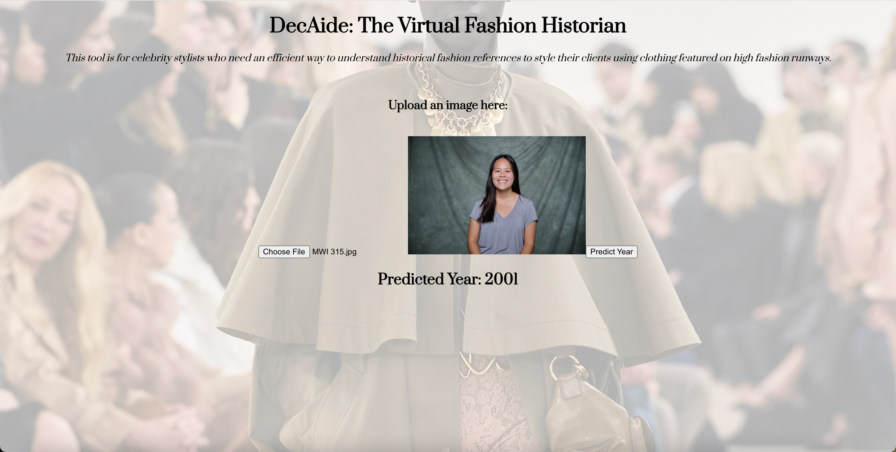

## Project Milestone 4 Organization

**The following diagram is based on the milestone4 branch where we stored the relevant information for the milestone 4 deliverable.**
<br>

```
.
├── Midterm Presentation
│   └── Milestone 3 Presentaion_ DecAide (1).pptx
├── README.md
├── images
│   ├── backend.png
│   ├── frontend.jpeg
│   ├── solution-arch.png
│   └── technical-arch.png
├── notebooks
│   └── eda_initial_models_ac215.ipynb
├── references
│   └── Milestone 3_ Draft .docx
├── reports
│   └── app_mockups
│       ├── Milestone 2 Mock Up Final.pdf
│       └── drafts
│           ├── APCOMP 215 Milestone 2 Mock Up.pdf
│           └── Milestone 2 Mock Up Backend.pdf
├── src
│   ├── api-service
│   │   ├── Dockerfile
│   │   ├── best_model.h5.keras
│   │   ├── docker-shell.sh
│   │   ├── label_encoder.pkl
│   │   ├── main.py
│   │   └── requirements.txt
│   ├── datapipeline
│   │   ├── data_versioning
│   │   │   ├── Dockerfile
│   │   │   ├── Pipfile
│   │   │   ├── Pipfile.lock
│   │   │   ├── decaide_data.dvc
│   │   │   ├── docker-entrypoint.sh
│   │   │   └── docker-shell.sh
│   │   ├── preprocessing
│   │   │   ├── Dockerfile
│   │   │   ├── Pipfile
│   │   │   ├── Pipfile.lock
│   │   │   ├── docker-entrypoint.sh
│   │   │   ├── docker-shell.sh
│   │   │   └── preprocessing.py
│   │   └── scraping
│   │       ├── download_pics.ipynb
│   │       └── scraping_urls.ipynb
│   ├── frontend
│   │   └── image-year-predictor
│   │       ├── README.md
│   │       ├── package-lock.json
│   │       ├── package.json
│   │       ├── public
│   │       │   ├── background1.jpg
│   │       │   ├── background2.jpg
│   │       │   ├── background3.jpg
│   │       │   ├── background4.jpg
│   │       │   ├── background5.jpg
│   │       │   ├── favicon.ico
│   │       │   ├── index.html
│   │       │   ├── logo192.png
│   │       │   ├── logo512.png
│   │       │   ├── manifest.json
│   │       │   └── robots.txt
│   │       └── src
│   │           ├── App.css
│   │           ├── App.js
│   │           ├── index.css
│   │           ├── index.js
│   │           ├── logo.svg
│   │           ├── reportWebVitals.js
│   │           └── setupTests.js
│   └── models
│       └── modeling
│           └── updated_models_ac215.ipynb
└── tests
    ├── App.test.js
    ├── test_error_handling.py
    ├── test_generate_caption.py
    ├── test_generate_caption_endpoint
    ├── test_load_label_encoder.py
    ├── test_load_model.py
    ├── test_predict.py
    ├── test_predict_endpoint
    ├── test_preprocess_image.py
    └── test_standardize_image.py

```
# APCOMP 215: DecAide 

<br>

**Team Members:** Tom Zhou, Paige Lee, Sophie Thrope, and Josha Thomas

**Group Name:** DecAide

**Project:** The "DecAide" project is a virtual tool designed to help celebrity stylists quickly access historical fashion references by analyzing high-fashion runway images. The team scraped approximately 6,000 runway images from vogue.com and trained a deep learning model using transfer learning with ResNet50. The model categorizes fashion looks by era, allowing stylists to streamline their research process when styling clients, especially for events like the Met Gala, where specific fashion themes must be followed. The project utilizes Docker containers and Google Cloud for scalability, with plans for further model optimization and deployment.

Our midterm presentation is in the `Midterm Presentation` folder.

## **Milestone4**

In this milestone, we have the components for frontend, API service, also components from previous milestones for data management, including versioning, as well as the computer vision and language models. This will be our user-facing application that ties together the various components built in previous milestones.

### Application Design

The people involved in the process of our solution include data scientists (build the ResNet model and design the web app), admin (maintain data in GCP buckets), developers (create the web app and connect it with the ResNet model via Fast API), and the users (celebrity stylists who upload images to and interact with the web app). The frontend of the web app is built using React, the backend service is GCP, the ResNet model was built, trained, and tested in a Google Colab notebook, and LLMs were used for caption text generation and/or similarity-based retrieval of word and image embeddings that are semantically similar in the representation space. The data store is Vogue images that were web-scraped and uploaded to a GCP bucket, Docker containers were used for the web scraping and model deployment, and GitHub was used for source control. 

#### Solution Architecture

Our Solution Architecture is a high-level overview of the system components and their interactions.


#### Technical Architecture

Our Technical Architecture specifies the technologies, frameworks, and design patterns that we used.


### Backend API

We built a backend API service using Fast API to connect the model with our frontend. 


### Frontend Implementation

We built a React app to identify the year and other related information for a fashion image using computer vision models from the backend. Using the app, a celebrity stylist user can take a picture of an outfit and upload it. The app will send the image to the backend API to get a prediction of the year, generated text caption, and retrieve similar images. 



### Steps for running the web app locally

1. Start the API
    + Open a new Terminal window -> go to the ac215_DecAide repo in your computer
    + `cd src`
    + `cd api-service`
    + `./docker-shell.sh`
    + The container and image take ~2-3 minutes to build -> you must wait until you see **"DEBUG:root:Root endpoint hit. (WEB APP/API READY TO USE!!!)"** at the end of your logs in the terminal. There may be some pauses in the logs that are generated, but you must wait until the above statement is printed otherwise the API won't be ready to use.
2. Start the React web app
    + Open a new Terminal window -> go to the ac215_DecAide repo in your computer
    + `cd src`
    + `cd frontend`
    + `cd image-year-predictor`
    + `cd src`
    + `npm start`
    + The React web app will launch in a new Chrome browser window! You may need to install some dependencies related to React before `npm start` can be run (Node.js and `npm install`).

## **Milestone3**

In this milestone, we have the components for data management, including versioning, and the computer vision model.  

**Data** The current version of images are scarped from *runway images on vougue.com*. Beautifulsoup and Requests-HTML packages are used. Total of 4221 shows are scraped. Among those, we scraped ~150 shows, including all years from 1988 to 2015, resulting in ~6000 runway pictures. It takes ~3 seconds to scrape a picture. PLEASE DO NOT RUN the notebooks for time considerations.

## **Midterm Presentation**

*The `Midterm Presentation` directory contains the slides from our presentation.*

<br>

## **Notebooks**

*The `notebooks` directory contains the eda_intial_mdoels notebook that outlines our prelimnary model.*

<br>

## **References**

*The `references` directoey contains `Milestone 3_Draft.docx` it outlines the contents of our milestone 3 presentation, amnd includes a reference.*

<br>

## **SRC**

*The `src` directory contains the corresponding directories and scripts for the data pipeline and modeling.*

<br>

### **Data Pipeline Overview**

<br>

### Preprocessing

The processing pipeline is used to resize the images and make the resolutions compatible for our models. The processing is done locally using Docker containers, then the processed images can be uploaded to Google Cloud buckets.

Tutorial:

1) cd into `src/datapipeline/preprocessing`, where you can find the Dockerfile, Pipfile, and docker-shell.sh.

2) Run `sh docker-shell.sh`. This will run the docker container.

3) In the container environment, run `py preprocessing.py <raw data folder name>`.

The folder structure should look like:

* **preprocessing/** 
    
* **secrets/**
    * pics/
      * raw_data_1/
        * pic#1.jpg
        * pic#2.jpg
        * ...
      * raw_data_2/
      * ...
    * clean_data
    * other secrets

### Data Versioning

We used the standard data versioning pipeline as shown in the tutorial #7 `https://github.com/dlops-io/data-versioning`.

Tutorial:

1) cd into `src/datapipeline/data_versioning`, where you can find the Dockerfile, Pipfile, and docker-shell.sh.

2) Run `sh docker-shell.sh`. This will run the docker container.

3) In the container environment, run `git init and dvc init` if the dvc has not been initialized. After that, there should be a data folder under `/app`, `/app/decaide_data`. The data from the bucket `/ac215-decaide/images/...` will be mounted here.

4) Run `dvc remote add -d decaide_data gs://ac215-decaide/dvc_store`.

5) Run `dvc add decaide_data`.

6) Run `dvc push`.

<br>

### Models

*The models directory contains the updated modeling jupyter notebooks.*

<br>

### Modeling

`In this milestone we were able **icrease model acuracy from 50% to 90%** by training for an increased number of epochs **(now 30 epochs)**, details  below.`

For the **updated** model, the cleaned data is loaded from the bucket, converted to tensors, and standardized. The corresponding year labels for the images are encoded using sklearn, duplicates are dropped from the dataset, and a TensorFlow Dataset is created. 

**Our model can be found in `models/modeling/updated_models_ac215.ipynb`.** The model employs transfer learning, making use of a ResNet50 model initially trained on the ImageNet dataset. A global average pooling layer was added along with a dense layer and the output layer, which outputs a year category for each image. The last ten layers of the ResNet50 model were unfrozen and trained. Categorical cross-entropy was used for the loss, Adam for the optimizer, accuracy for the metric, and the model was trained for **thirty** epochs. 

**We were able to achieve over 90% classification accuracy on our model after fine-tuning it and training it for more epochs with a GPU. Most of the progress for this milestone consisted of experimenting with different methodologies for running and hosting the model.** However, more fine-tuning will be done, with data augmentation methods, SMOTE, and further hyperparameter fine-tuning being done to address class imbalance, distribution shift, and other issues currently seen in the model and dataset. 

**Additionally, we plan on implementing caption generation for the images, as well as potentially a CLIP model fine-tuned on our dataset, in order to expand user features.**

<br>

## **Reports**

*The reports directory includes a mockup of our app.*

<br>

### Mock App

The mock up of the app can be found in `reports/app_mockups/Milestone 2 Mock Up Final.pdf`. Users can upload a runway image of an outfit, and the app will determine the decade it is from, providing similar outfits from that era as additional references. 

The app connects to a Google Colab script that runs a machine learning model, which scrapes relevant fashion data and stores it in Google Cloud. The data processing is managed through a Docker container, so that our app is scalable. The app is designed for efficient fashion era identification, making it a useful tool for stylists.

<br>

### Tests

### README: Testing Overview

This section describes the various tests we have implemented for the project, detailing the functionality they cover, the tools used, and the purpose of each test.

---

#### Code Build and Linting

The automated build process and code quality checks are managed using **GitHub Actions**, ensuring that the project is continuously integrated and maintains a high standard of code quality. The following tools are used in the build process:

- **ESLint**: For linting JavaScript/React code. It helps enforce code style rules and identify potential errors.
- **Flake8**: For linting Python code, ensuring that the code adheres to PEP8 standards and best practices.

---

#### Automated Testing

The tests are divided into **unit tests**, **integration tests**, and **system tests**, each serving a different purpose in verifying the functionality of the application. 

---

### Unit Tests

Unit tests focus on individual functions, verifying that they perform as expected. Below are the unit tests implemented for the project:

1. **test_standardize_image**  
   *Tests the `standardize_image` function.*  
   - **Purpose**: To ensure that images are standardized correctly by removing any metadata (e.g., from iPhones) after loading.
   - **Tools Used**: **Jest** (for running the test) and **React Testing Library** (for rendering and testing the image processing functions).

2. **test_load_model**  
   *Tests the function that loads the model weights (Sophie’s CV model).*  
   - **Purpose**: Verifies that the correct model weights are loaded from the `.h5` file and the model is ready for predictions.
   - **Tools Used**: **pytest**, **unittest** (for Python), and **mocking** (to avoid actual I/O operations during tests).

3. **test_load_label_encoder**  
   *Tests the function that loads the label encoder (pkl file).*  
   - **Purpose**: Ensures that the label encoder is correctly loaded from the `.pkl` file, which is essential for the CV model's classification.
   - **Tools Used**: **pytest**, **mocking** (to mock the file loading process).

4. **test_preprocess_image**  
   *Tests the image preprocessing function.*  
   - **Purpose**: Verifies that the image is preprocessed in the same way as the images used in training Sophie’s CV model (e.g., resizing, normalization).
   - **Tools Used**: **pytest** and **mocking** (for simulating image preprocessing).

---

### Integration Tests

Integration tests verify that different parts of the system work together as expected. These tests specifically test the integration of the model loading and prediction system via API endpoints:

1. **test_predict_endpoint**  
   *Tests the `predict` endpoint of the API.*  
   - **Purpose**: Verifies that the API endpoint correctly integrates image loading, preprocessing, and the model’s prediction logic to predict the year of an image.
   - **Tools Used**: **pytest**, **requests** (to simulate HTTP requests), and **mocking** (for image-related functions).

2. **test_generate_caption_endpoint**  
   *Tests the `generate_caption` endpoint of the API.*  
   - **Purpose**: Verifies that the API endpoint correctly integrates the image loading, preprocessing, and uses the Salesforce LLM to generate a caption for the image.
   - **Tools Used**: **pytest**, **requests**, and **mocking** (for image-related functions and the LLM).

---

### System Tests

System tests cover the complete user flow from uploading an image to receiving a prediction or caption, ensuring that all components work as expected when combined. These tests include error handling scenarios:

1. **Complete User Flow (Predict and Generate Caption)**  
   *Test the system with realistic data to simulate the full user interaction, covering both the `predict` and `generate-caption` endpoints.*  
   - **Purpose**: Simulates a complete use case, starting from image upload, image processing, and API interaction, including both the prediction of the year and generation of the caption.
   - **Tools Used**: **Jest**, **React Testing Library** (for front-end interaction), **requests**, and **pytest** (for API testing).

2. **Test for Supported Image Formats**  
   *Test that the system works with realistic image data (jpeg, jpg, png, webp).*  
   - **Purpose**: Ensures that the system can correctly process a variety of image formats commonly used in web applications.
   - **Tools Used**: **Jest**, **React Testing Library** (for file upload simulation), and **pytest** (for backend image processing validation).

3. **Error Handling Test (PDF File Upload)**  
   *Test the error handling by submitting a non-image file (e.g., PDF).*  
   - **Purpose**: Verifies that the system gracefully handles unsupported file types, like PDFs, by returning the appropriate error message.
   - **Tools Used**: **Jest**, **React Testing Library** (for testing error states), and **pytest** (for testing API response handling of incorrect file types).

---

### Tools and Libraries Used

- **Jest**: For running unit tests and simulating user interactions in the front-end (React).
- **React Testing Library**: For testing React components, particularly rendering and simulating user input like file uploads and button clicks.
- **pytest**: A testing framework for Python that simplifies writing test cases and assertions.
- **requests**: Used in integration tests for sending HTTP requests to the API endpoints.
- **mocking**: Mocking libraries such as `unittest.mock` in Python are used to simulate file loading or external dependencies during tests (e.g., mocking image loading and model prediction).
- **Flake8**: A Python linting tool to ensure code adheres to PEP8 and other Python style guidelines.
- **ESLint**: A JavaScript linter to catch potential issues and enforce consistent coding style in the front-end code.

---