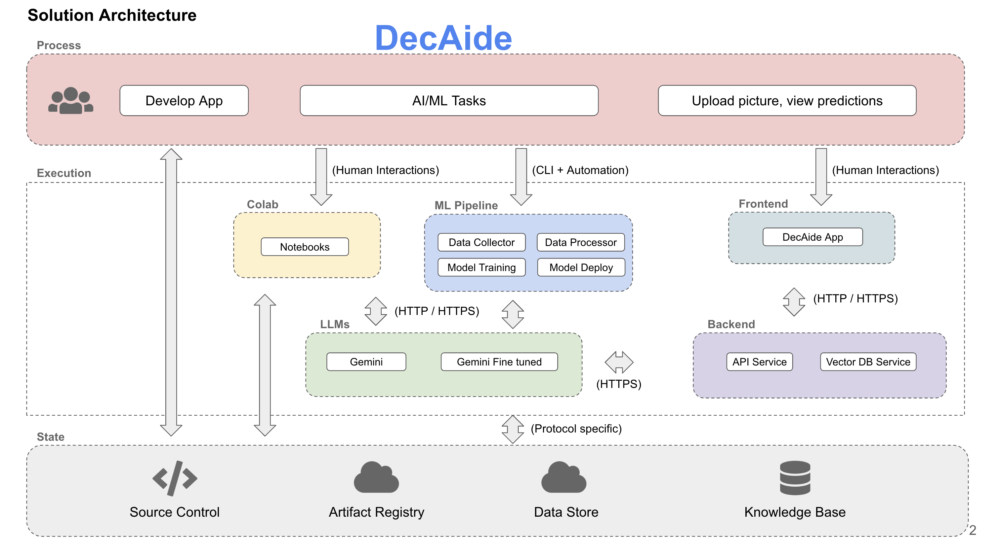
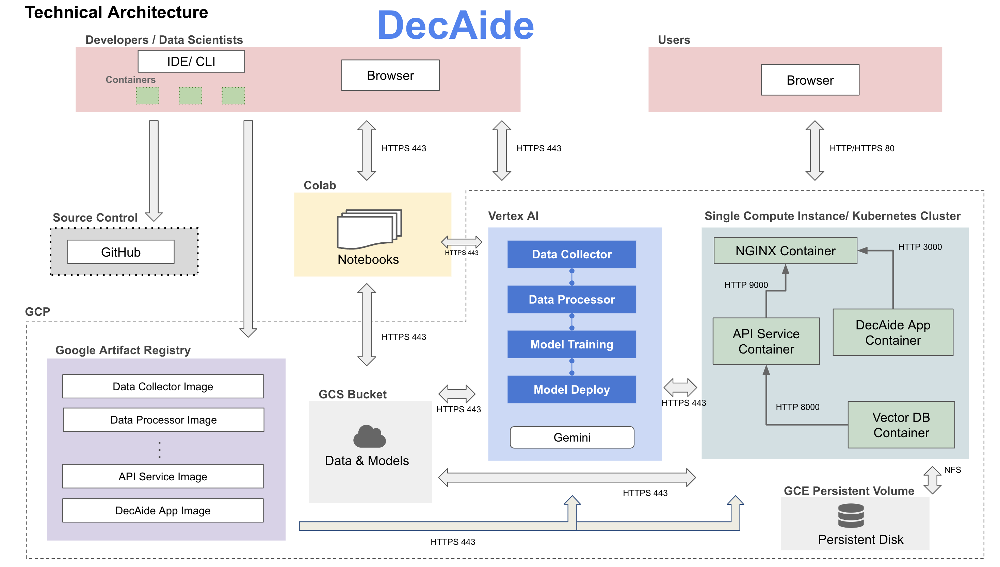

## Project Milestone 4 Organization

**The following diagram is based on the milestone4 branch where we stored the relevant information for the milestone 4 deliverable.**
<br>

```
.
├── README.md
├── Midterm Presentation
│   └── Milestone 3 Presentaion_ DecAide (1).pptx
├── images
    └── solution-arch.png
├── notebooks
│   └── eda_initial_models_ac215.ipynb
├── references
│   └── Milestone 3_ Draft .docx
├── reports
│   └── app_mockups
│       ├── Milestone 2 Mock Up Final.pdf
│       └── drafts
│           ├── APCOMP 215 Milestone 2 Mock Up.pdf
│           └── Milestone 2 Mock Up Backend.pdf
└── src
    ├── datapipeline
    │   ├── data_versioning
    │   │   ├── Dockerfile
    │   │   ├── Pipfile
    │   │   ├── Pipfile.lock
    │   │   ├── decaide_data.dvc
    │   │   ├── docker-entrypoint.sh
    │   │   └── docker-shell.sh
    │   ├── preprocessing
    │   │   ├── Dockerfile
    │   │   ├── Pipfile
    │   │   ├── Pipfile.lock
    │   │   ├── docker-entrypoint.sh
    │   │   ├── docker-shell.sh
    │   │   └── preprocessing.py
    │   └── scraping
    │       ├── download_pics.ipynb
    │       └── scraping_urls.ipynb
    └── models
        └── modeling
            └── updated_models_ac215.ipynb
```
# APCOMP 215: DecAide 

<br>

**Team Members:** Tom Zhou, Paige Lee, Sophie Thrope, and Josha Thomas

**Group Name:** DecAide

**Project:** The "DecAide" project is a virtual tool designed to help celebrity stylists quickly access historical fashion references by analyzing high-fashion runway images. The team scraped approximately 6,000 runway images from vogue.com and trained a deep learning model using transfer learning with ResNet50. The model categorizes fashion looks by era, allowing stylists to streamline their research process when styling clients, especially for events like the Met Gala, where specific fashion themes must be followed. The project utilizes Docker containers and Google Cloud for scalability, with plans for further model optimization and deployment.

Our midterm presentation is in the `Midterm Presentation` folder.

## **Milestone4**

In this milestone, we have the components for frontend, API service, also components from previous milestones for data management, including versioning, as well as the computer vision and language models. This will be our user-facing application that ties together the various components built in previous milestones.

### Application Design

The people involved in the process of our solution include data scientists (build the ResNet model and design the web app), admin (maintain data in GCP buckets), developers (create the web app and connect it with the ResNet model via Fast API), and the users (celebrity stylists who upload images to and interact with the web app). The frontend of the web app is built using React, the backend service is GCP, the ResNet model was built, trained, and tested in a Google Colab notebook, and LLMs were used for caption text generation and/or similarity-based retrieval of word and image embeddings that are semantically similar in the representation space. The data store is Vogue images that were web-scraped and uploaded to a GCP bucket, Docker containers were used for the web scraping and model deployment, and GitHub was used for source control. 

#### Solution Architecture

Our Solution Architecture is a high-level overview of the system components and their interactions.



#### Technical Architecture

Our Technical Architecture specifies the technologies, frameworks, and design patterns that we used.



## **Milestone3**

In this milestone, we have the components for data management, including versioning, and the computer vision model.  

**Data** The current version of images are scarped from *runway images on vougue.com*. Beautifulsoup and Requests-HTML packages are used. Total of 4221 shows are scraped. Among those, we scraped ~150 shows, including all years from 1988 to 2015, resulting in ~6000 runway pictures. It takes ~3 seconds to scrape a picture. PLEASE DO NOT RUN the notebooks for time considerations.

## **Midterm Presentation**

*The `Midterm Presentation` directory contains the slides from our presentation.*

<br>

## **Notebooks**

*The `notebooks` directory contains the eda_intial_mdoels notebook that outlines our prelimnary model.*

<br>

## **References**

*The `references` directoey contains `Milestone 3_Draft.docx` it outlines the contents of our milestone 3 presentation, amnd includes a reference.*

<br>

## **SRC**

*The `src` directory contains the corresponding directories and scripts for the data pipeline and modeling.*

<br>

### **Data Pipeline Overview**

<br>

### Preprocessing

The processing pipeline is used to resize the images and make the resolutions compatible for our models. The processing is done locally using Docker containers, then the processed images can be uploaded to Google Cloud buckets.

Tutorial:

1) cd into `src/datapipeline/preprocessing`, where you can find the Dockerfile, Pipfile, and docker-shell.sh.

2) Run `sh docker-shell.sh`. This will run the docker container.

3) In the container environment, run `py preprocessing.py <raw data folder name>`.

The folder structure should look like:

* **preprocessing/** 
    
* **secrets/**
    * pics/
      * raw_data_1/
        * pic#1.jpg
        * pic#2.jpg
        * ...
      * raw_data_2/
      * ...
    * clean_data
    * other secrets

### Data Versioning

We used the standard data versioning pipeline as shown in the tutorial #7 `https://github.com/dlops-io/data-versioning`.

Tutorial:

1) cd into `src/datapipeline/data_versioning`, where you can find the Dockerfile, Pipfile, and docker-shell.sh.

2) Run `sh docker-shell.sh`. This will run the docker container.

3) In the container environment, run `git init and dvc init` if the dvc has not been initialized. After that, there should be a data folder under `/app`, `/app/decaide_data`. The data from the bucket `/ac215-decaide/images/...` will be mounted here.

4) Run `dvc remote add -d decaide_data gs://ac215-decaide/dvc_store`.

5) Run `dvc add decaide_data`.

6) Run `dvc push`.

<br>

### Models

*The models directory contains the updated modeling jupyter notebooks.*

<br>

### Modeling

`In this milestone we were able **icrease model acuracy from 50% to 90%** by training for an increased number of epochs **(now 30 epochs)**, details  below.`

For the **updated** model, the cleaned data is loaded from the bucket, converted to tensors, and standardized. The corresponding year labels for the images are encoded using sklearn, duplicates are dropped from the dataset, and a TensorFlow Dataset is created. 

**Our model can be found in `models/modeling/updated_models_ac215.ipynb`.** The model employs transfer learning, making use of a ResNet50 model initially trained on the ImageNet dataset. A global average pooling layer was added along with a dense layer and the output layer, which outputs a year category for each image. The last ten layers of the ResNet50 model were unfrozen and trained. Categorical cross-entropy was used for the loss, Adam for the optimizer, accuracy for the metric, and the model was trained for **thirty** epochs. 

**We were able to achieve over 90% classification accuracy on our model after fine-tuning it and training it for more epochs with a GPU. Most of the progress for this milestone consisted of experimenting with different methodologies for running and hosting the model.** However, more fine-tuning will be done, with data augmentation methods, SMOTE, and further hyperparameter fine-tuning being done to address class imbalance, distribution shift, and other issues currently seen in the model and dataset. 

**Additionally, we plan on implementing caption generation for the images, as well as potentially a CLIP model fine-tuned on our dataset, in order to expand user features.**

<br>

## **Reports**

*The reports directory includes a mockup of our app.*

<br>

### Mock App

The mock up of the app can be found in `reports/app_mockups/Milestone 2 Mock Up Final.pdf`. Users can upload a runway image of an outfit, and the app will determine the decade it is from, providing similar outfits from that era as additional references. 

The app connects to a Google Colab script that runs a machine learning model, which scrapes relevant fashion data and stores it in Google Cloud. The data processing is managed through a Docker container, so that our app is scalable. The app is designed for efficient fashion era identification, making it a useful tool for stylists.
