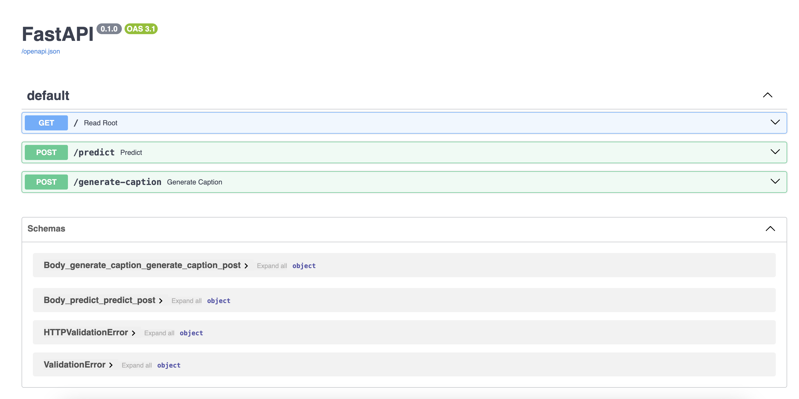

## APCOMP 215: DecAide

<br>

**Team Members:** Tom Zhou, Paige Lee, Sophie Thrope, and Josha Thomas

**Group Name:** DecAide

**Project:** The "DecAide" project is a virtual tool designed to help celebrity stylists quickly access historical fashion references by analyzing high-fashion runway images. The team scraped approximately 6,000 runway images from vogue.com and trained a deep learning model using transfer learning with ResNet50. The model categorizes fashion looks by era, allowing stylists to streamline their research process when styling clients, especially for events like the Met Gala, where specific fashion themes must be followed. The project utilizes Docker containers and Google Cloud for scalability, with plans for further model optimization and deployment.

---

## Prerequisites and Setup Instructions

### Prerequisites

Make sure you have the following tools installed on your machine:

- **Node.js & npm** for front-end tests (React app).
- **Python 3.x** for back-end tests (Flask/Django API).
- **pip** for Python package management.
- **pipenv** (optional, for Python environment management).
- **Git** to clone the repository.
- **Docker** (optional, for containerized testing).

Installation Links:

- [Node.js](https://nodejs.org/)
- [Python](https://www.python.org/downloads/)
- [Git](https://git-scm.com/)
- [Docker](https://www.docker.com/get-started)

### Setup Instructions

1. Clone the Repository:

   ```bash
   git clone <repository_url>
   cd <repository_name>
   ```

2. Install Dependencies:

   - **For the Front-End:**
     ```bash
     npm install
     ```
   - **For the Back-End:**
     ```bash
     pip install -r requirements.txt
     ```

3. Optional: Create a Python Virtual Environment:

   ```bash
   python3 -m venv venv
   source venv/bin/activate  # For Linux/macOS
   .\venv\Scripts\activate   # For Windows
   ```

4. Run Docker Shells for Various Pipelines:

   Navigate to the respective directories and execute `sh docker-shell.sh` to set up containers for preprocessing, data versioning, and deployment.

---

## Deployment Instructions

### Backend API Service

1. Navigate to the API service directory:
   ```bash
   cd src/api_service
   ```

2. Start the Docker Container:
   ```bash
   ./docker-shell.sh
   ```

3. Wait for the following log message to confirm readiness:
   ```bash
   DEBUG:root:Root endpoint hit. (WEB APP/API READY TO USE!!!)
   ```

### Frontend React App

1. Navigate to the React app directory:
   ```bash
   cd src/frontend/image-year-predictor/src
   ```

2. Start the Application:
   ```bash
   npm start
   ```

3. The app will launch in a new browser window. Install any missing dependencies using:
   ```bash
   npm install
   ```

### Dockerized Deployment

1. Build the Docker Image:
   ```bash
   docker build -t <image_name> .
   ```

2. Run the Docker Container:
   ```bash
   docker run -p 8080:8080 <image_name>
   ```

---

## Usage Details and Examples

### Example Workflow

1. **Upload Image:** Open the frontend app and upload a high-fashion runway image.
2. **Predictions:** The app will display:
   - Predicted era (e.g., 1990s, 2000s).
   - Similar outfits from the same era.
   - A generated caption describing the image.

### API Endpoints

- **`/predict`:** Submit an image to receive era predictions.
- **`/generate-caption`:** Submit an image to receive an AI-generated caption.

### Data Pipeline

- **Preprocessing:** Resize and standardize images before model training.
- **Data Versioning:** Manage datasets using DVC for reproducibility.

---

## Known Issues and Limitations

1. **Class Imbalance:** Some eras have fewer examples, leading to potential misclassification.
2. **Dataset Quality:** Images scraped may vary in resolution and consistency.
3. **Scalability:** Current deployment is optimized for small-scale testing.
4. **Browser Compatibility:** Fully tested on Chrome; issues may arise on other browsers.
5. **Error Handling:** Non-image file uploads (e.g., PDFs) return generic error messages instead of detailed feedback.

---

For detailed instructions on testing, data pipelines, and further improvements, refer to the respective sections of the README.

### Solution Architecture

Our Solution Architecture is a high-level overview of the system components and their interactions.


### Technical Architecture

Our Technical Architecture specifies the technologies, frameworks, and design patterns that we used.


### Backend API

We built a backend API service using Fast API to connect the model with our frontend.



### Frontend Implementation

We built a React app to identify the year and other related information for a fashion image using computer vision models from the backend. Using the app, a celebrity stylist user can take a picture of an outfit and upload it. The app will send the image to the backend API to get a prediction of the year, generated text caption, and retrieve similar images.


